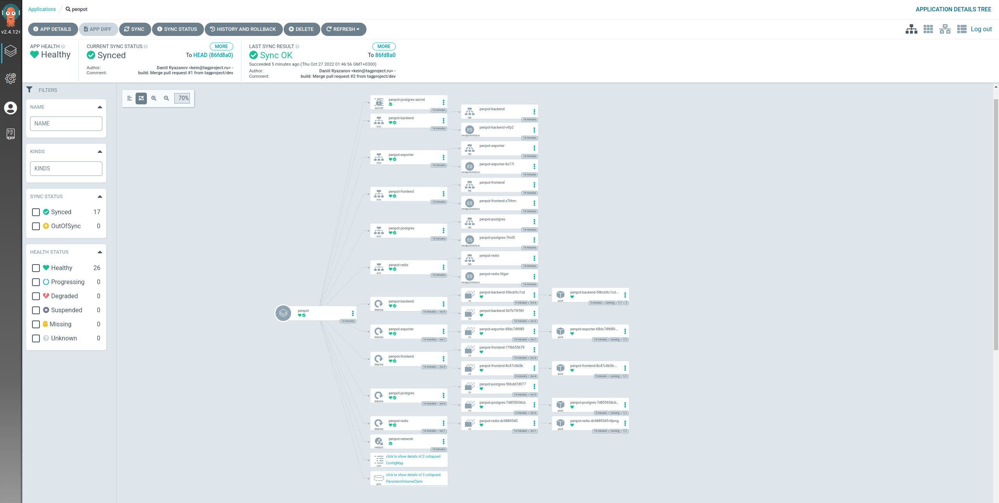

# Kubernetes manifests for Penpot platform deployment

Deploy [Penpot](https://penpot.app/) with ArgoCD and Kustomization.

## Set configuration parameters

Changed **default** env:

- PENPOT_ASSETS_STORAGE_BACKEND: `assets-db` - stores them inside the PostgreSQL database, in a special table with a binary column.
- PENPOT_FLAGS: `disable-registration enable-login disable-email-verification enable-backend-api-docs`
  - `disable-registration` - completely disable registration
  - `enable-login` - show login form (don't worry, the registration form is displayed but not working)
  - `disable-email-verification` - disable email verification for new users

> see more in [Advanced Configuration](https://help.penpot.app/technical-guide/configuration/)

## Prepare

In manifest use `namespace: penpot` and `namePrefix: penpot-`, you can change it in `kustomization.yaml`:

```yaml
namespace: penpot
namePrefix: penpot-
```

In my case i have `PersistentVolumes` by `1Gi`, `5Gi`, `10Gi` and `20Gi`. You can describe you own `PersistentVolumesClaims`:

- persistentvolumeclaim/penpot-postgres-pvc - `20Gi`
- persistentvolumeclaim/penpot-frontend-data-pvc - `1Gi`
- persistentvolumeclaim/penpot-backend-data-pvc - `1Gi`

### Change database username and password:

```yaml
# ./resources/secrets.yaml
username: penpot
password: penpot
```

## Deploy Penpot application with ArgoCD

Install ArgoCD and download ArgoCD CLI, see [getting started section](https://argo-cd.readthedocs.io/en/stable/getting_started/).

```sh
argocd app create penpot \
  --project default \
  --repo https://github.com/tagproject/k8s-penpot.git \
  --path ./ \
  --dest-server https://kubernetes.default.svc \
  --dest-namespace penpot \
  --sync-policy automated
```

<details>
<summary>After synchronization, you will see something like this in ArgoCD UI</summary>



</details>

Get `penpot-frontend` `EXTERNAL-IP` and open Penpot UI with you IP `http://192.168.0.x:9001`:

```sh
kubectl get svc/penpot-frontend -n penpot
```

|                 |              |            |             |                |     |
| --------------- | ------------ | ---------- | ----------- | -------------- | --- |
| NAME            | TYPE         | CLUSTER-IP | EXTERNAL-IP | PORT(S)        | AGE |
| penpot-frontend | LoadBalancer | 10.233.x.x | 192.168.0.x | 9001:30330/TCP | 1m  |
